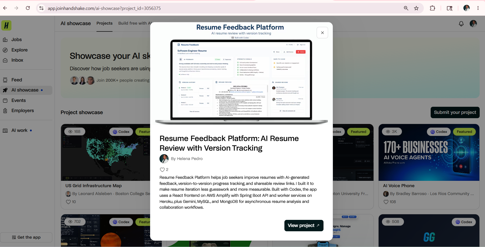

# AI-powered Resume Feedback Platform

Frontend application for a version-aware resume review workflow.

**Featured in the [Handshake AI Showcase](https://app.joinhandshake.com/ai-showcase?project_id=3056375) as part of the OpenAI Developers x Handshake Codex Creator Challenge.**



## Why this project exists

Most resume review workflows are fragmented.

People usually end up with:

- multiple renamed PDF files with no clear progression
- isolated feedback that does not stay attached to the version being reviewed
- generic AI suggestions that do not explain whether a new version actually improved
- comments and collaboration spread across chat, email, and separate documents

The result is noisy iteration. A candidate may get feedback on version 1, change the file, upload version 2, and still have no clear answer to the most important question:

**Did this new version actually get better?**

## The problem we solve

This project turns resume review into a version-aware product workflow instead of a one-off file upload.

It solves three practical problems:

- `Review context loss`: feedback, comments, and file versions often drift apart
- `Weak iteration visibility`: most tools can review a file, but cannot explain progress between versions
- `Low-quality collaboration`: external reviewers need a simpler, controlled way to preview and comment without joining the full account workflow

## The impact this creates

The platform changes the user experience from “upload and get generic feedback” to “iterate with evidence.”

That creates product impact in a few ways:

- users can see both the current AI review and how the latest version compares to the previous one
- improvements, unresolved issues, and new regressions become explicit
- reviewers can comment in context on the version actually under discussion
- version history stays structured, which makes resume iteration more disciplined and less chaotic

In short, the product is designed to help job seekers improve faster because the system tracks not only what is wrong, but what changed.

## Featured

This project was also shared in a LinkedIn post about the Handshake feature.

- [Open the embedded feature page](./docs/featured.html)
- [Open the LinkedIn post directly](https://www.linkedin.com/embed/feed/update/urn:li:ugcPost:7462595076766982145)
- [Open the Handshake showcase entry](https://app.joinhandshake.com/ai-showcase?project_id=3056375)

## What the product does

The current app supports:

- email/password sign up and sign in
- Google sign in via Google Identity Services
- resume creation and version uploads
- version-aware preview and download
- AI feedback generation with async job polling
- AI progress comparison between resume versions
- recruiter-style feedback display with summary, strengths, and improvements
- share link creation, revocation, expiration, and usage limits
- version-specific comments
- pinned resumes and dashboard search
- basic profile management

## Product model

The product makes two different AI promises and keeps them separate in the UI:

1. `AI Feedback for the current version`
   This answers: “Is this version good?”

2. `Progress since the previous version`
   This answers: “Did this version improve compared to the last one?”

That distinction is central to the product. The goal is not only to analyze resumes, but to support better iteration over time.

## Tech Stack

- React 18
- TypeScript
- Vite 5
- React Router 6
- Redux Toolkit + React Redux
- TanStack Query
- Tailwind CSS
- shadcn/ui + Radix UI
- React Hook Form
- Zod
- react-pdf

## Application Structure

The codebase is organized by responsibility:

- `src/pages` route-level screens
- `src/components` reusable UI and feature components
- `src/components/ai-feedback` modularized AI feedback presentation components
- `src/components/resume-details` modularized resume details page components
- `src/features` feature hooks and orchestration logic
- `src/store` Redux store, slices, and typed hooks
- `src/services` API client and service layer
- `src/contexts` app-wide providers and compatibility wrappers
- `src/lib` small shared utilities
- `src/types` shared TypeScript contracts

## UI Architecture

The UI layer is intentionally split across route screens, feature orchestration, and reusable presentation components.

- `src/pages` owns route composition, page shells, and page-level layout
- `src/features` owns stateful hooks and feature orchestration
- `src/components` owns reusable presentational building blocks and feature UI
- `src/components/ui` owns low-level design-system primitives
- feature folders like `src/components/ai-feedback` and `src/components/resume-details` keep larger areas maintainable

Typical flow:

1. a route component in `src/pages` renders the screen shell
2. the page or feature component calls a hook from `src/features`
3. that hook coordinates Redux actions, queries, and service calls
4. resulting data is passed into focused presentational components in `src/components`

For deeper UI conventions, see [docs/ui-architecture.md](docs/ui-architecture.md).

## Main Routes

Public routes:

- `/`
- `/about`
- `/auth`
- `/share/:token`

Protected routes:

- `/my-resumes`
- `/upload`
- `/resume/:id`
- `/profile`

## AI data model

The backend returns version feedback in this shape:

```ts
{
  summary: string;
  strengths: string[];
  improvements: string[];
}
```

For version-to-version comparison, the backend also returns progress data:

```ts
{
  summary: string;
  progressStatus: string;
  progressScore: number;
  improvedAreas: string[];
  unchangedIssues: string[];
  newIssues: string[];
}
```

The frontend uses these two responses differently:

- feedback explains the quality of the current version
- progress explains what changed between the current version and the previous one

## Environment Variables

Create a `.env` file in the project root:

```bash
VITE_API_URL=https://your-api-host.com
VITE_GOOGLE_CLIENT_ID=your_google_client_id
```

Notes:

- `VITE_API_URL` is optional. If omitted, the app defaults to `https://resumefeedback-api.hmpedro.com`
- if `VITE_API_URL` ends with `/api`, the frontend normalizes it automatically
- `VITE_GOOGLE_CLIENT_ID` is required for Google sign in

## Local Development

Prerequisites:

- Node.js 18+
- npm 9+ or Bun

Install dependencies:

```bash
npm install
```

Start the dev server:

```bash
npm run dev
```

Build for production:

```bash
npm run build
```

Preview the production build:

```bash
npm run preview
```

Run lint:

```bash
npm run lint
```

## Available Scripts

```json
{
  "dev": "vite",
  "build": "vite build",
  "build:dev": "vite build --mode development",
  "lint": "eslint .",
  "preview": "vite preview"
}
```

## State and Data Flow

The app currently uses both Redux Toolkit and TanStack Query:

- Redux manages auth, upload flow, resume details, comments, share links, and AI feedback job state
- TanStack Query is used for resume list fetching and newer API-backed query flows
- local component state handles transient UI-only behavior

Important feature hooks:

- `src/features/upload/useUploadPage.ts`
- `src/features/resume-details/useResumeDetailsPage.ts`
- `src/features/ai/useAiFeedback.ts`
- `src/features/ai/useAiProgress.ts`

## API Integration Notes

- `src/services/api-config.ts` normalizes the backend base URL
- `src/services/api-client.ts` injects the JWT token from `localStorage`
- non-`FormData` requests are sent as JSON
- preview and file endpoints may use direct URLs instead of standard JSON fetch flows
- API failures are mapped into a normalized frontend error shape

## Authentication Notes

Current auth behavior:

- JWT access token is stored in `localStorage`
- the frontend reconstructs user state from the token payload
- `ProtectedRoute` guards authenticated pages
- `AuthProvider` exposes a compatibility layer for the rest of the app

Supported auth flows:

- register with email/password
- sign in with email/password
- sign in with Google

## Current UX Areas

- landing and about pages explain the problem and the workflow
- dashboard shows searchable and pinnable resume workflows
- upload page supports new resumes and additional versions
- resume details page combines AI review, progress comparison, preview, version history, comments, and share links
- shared resume page supports external review through tokenized access

## Project Notes

- local storage is currently used for auth token persistence and pinned resume preferences

## Related Docs

- `docs/featured.html` for the LinkedIn embed page
- `docs/frontend-handoff.local.md` for backend integration and local handoff notes
- `docs/ui-architecture.md` for UI-layer structure, boundaries, and conventions
